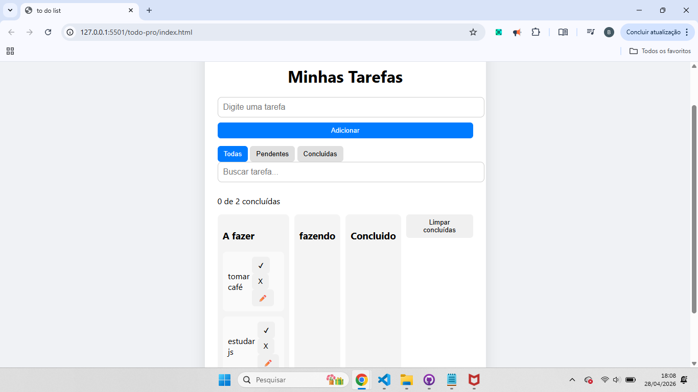

# 📝 taskboard-js

Aplicação de lista de tarefas estilo Kanban com drag-and-drop, filtros e persistência de dados no navegador.

---

## 🚀 Funcionalidades

- ✅ Adicionar tarefas
- ✅ Editar tarefas
- ✅ Remover tarefas
- ✅ Mover tarefas entre colunas (drag-and-drop)
- ✅ Filtro de tarefas
- ✅ Busca em tempo real
- ✅ Persistência com localStorage
- ✅ Organização modular com ES Modules

---

## 🛠 Tecnologias

- HTML5
- CSS
- JavaScript (ES6 Modules)

---

## 📸 Preview



## 💡 Aprendizados

Durante o desenvolvimento deste projeto, pratiquei:

- Manipulação de DOM
- Gerenciamento de estado
- Event Delegation
- Drag and Drop API
- Modularização de código
- Persistência de dados com localStorage
- Organização de arquitetura frontend

---

## ▶️ Como executar

1. Clone o repositório
2. Abra o projeto no VS Code
3. Execute com Live Server

```
git clone URL_DO_REPOSITORIO
```

---

## 📌 Status do projeto

🚧 Novas funcionalidades em desenvolvimento